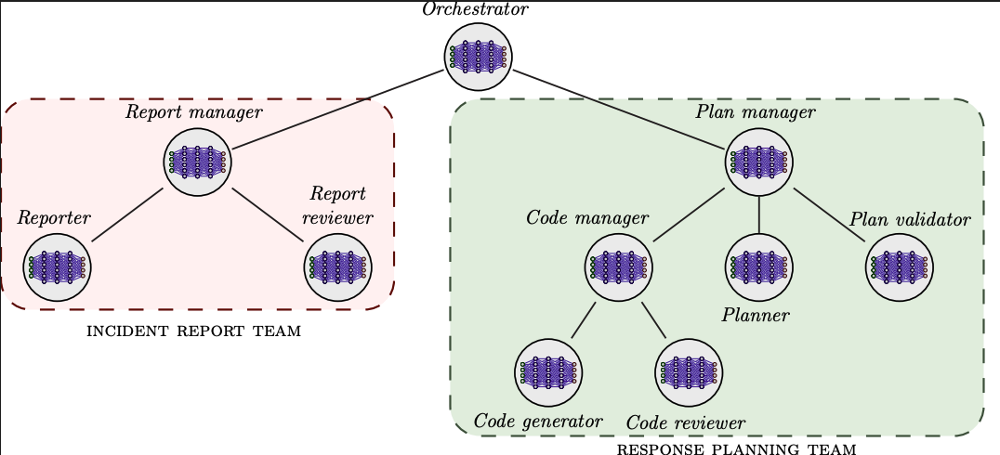

# Multiagent Incident Response Planning with Code Models

This repository includes to code of a **multiagent incident response system** that leverages large language models 
(LLMs) to assist security operators during incident handling. 

The system consists of a collection of agents that work together to automate incident response tasks and provide 
insights to security operators. Each agent is designed to perform a specific role in the incident response process, 
such as generating an incident report, orchestrating the planning, and generating a response plan. 

To achieve their goals, the agents interact with each other and can invoke a set of **tools**. In particular, the 
agents have access to the following tools:

### Available Tools
* **Digital twin terminal:** This tool allows agents to execute arbitrary bash commands inside a digital twin 
* (i.e., a virtual replica) of the system that was affected by the incident.
* **Threat intelligence APIs and knowledge bases:** This tool allows agents to retrieve information from external 
* knowledge bases and threat intelligence APIs (e.g., the OTX API).
* **Python sandbox:** This tool allows agents to execute arbitrary Python code within a sandboxed environment.

### Agent Types and Roles
The multiagent system includes **12 different types of agents** organized in a hierarchical structure:

1.  **Orchestrator:** Responsible for orchestrating the overall incident response process.
2.  **Host analyzer:** Responsible for analyzing a specific host of the digital twin.
3.  **Reporter:** Responsible for analyzing the digital twin and generating an incident report.
4.  **Report verifier:** Responsible for verifying a report generated by the Reporter agent.
5.  **Report manager:** Coordinates the process of generating the incident report; specifically, it decides how many times to revise and verify the report.
6.  **Attack path verifier:** Responsible for verifying the attack path in the incident report returned by the report manager agent.
7.  **Code generator:** Responsible for generating a code model of the process of recovering from the incident.
8.  **Code verifier:** Responsible for verifying the code generated by the code generator agent.
9.  **Code manager:** Coordinates the process of generating the code model; specifically, it decides how many times to revise and verify the code.
10. **Planner:** Responsible for computing a response plan based on the code model (e.g., through reinforcement learning).
11. **Plan verifier:** Responsible for verifying the plan generated by the planner.
12. **Plan manager:** Coordinates the process of generating the response plan; specifically, it decides how many times to revise and verify the plan.

<p align="center">

</p>

## Configuration

Before building or deploying, copy the example environment file and edit it with your credentials:

```bash
cp .env.example .env
```

The `.env` file contains the following settings:

| Variable            | Description                        | Default                          |
|---------------------|------------------------------------|----------------------------------|
| `POSTGRES_DB`       | PostgreSQL database name           | `ccs`                            |
| `POSTGRES_USER`     | PostgreSQL user                    | `ccs`                            |
| `POSTGRES_PASSWORD` | PostgreSQL password                | `CHANGE_ME_TO_A_STRONG_PASSWORD` |
| `ADMIN_USERNAME`    | Application admin login username   | `admin`                          |
| `ADMIN_PASSWORD`    | Application admin login password   | `CHANGE_ME_TO_A_STRONG_PASSWORD` |
| `GEMINI_API_KEY`    | Google Gemini API key              | `CHANGE_ME_TO_YOUR_GEMINI_API_KEY` |
| `ANTHROPIC_API_KEY` | Anthropic API key                  | `CHANGE_ME_TO_YOUR_ANTHROPIC_API_KEY` |
| `TAVILY_API_KEY`    | Tavily web search API key          | `CHANGE_ME_TO_YOUR_TAVILY_API_KEY` |
| `NVD_API_KEY`       | NIST NVD API key                   | `CHANGE_ME_TO_YOUR_NVD_API_KEY` |
| `VIRUSTOTAL_API_KEY`| VirusTotal API key                 | `CHANGE_ME_TO_YOUR_VIRUSTOTAL_API_KEY` |
| `ABUSEIPDB_API_KEY` | AbuseIPDB API key                  | `CHANGE_ME_TO_YOUR_ABUSEIPDB_API_KEY` |
| `OTX_API_KEY`       | AlienVault OTX API key             | `CHANGE_ME_TO_YOUR_OTX_API_KEY` |

The admin credentials are used to seed the initial login account on first startup. Make sure to set strong passwords before deploying.

To deploy remotely with Ansible, add your target hosts to `ansible/inventory.yml` under the `servers` group:

```yaml
servers:
  hosts:
    web1.example.com:
      ansible_user: ubuntu
```

Then run the playbook with `--limit servers`. See [`ansible/README.md`](ansible/README.md) for full details.

## Prerequisites

- Python 3.11+
- Node.js 22+

## Build the Frontend

```bash
cd ccs-response-planner-frontend
npm install
npm run build
```

This produces a production bundle in `ccs-response-planner-frontend/build/`.

## Install the Backend

```bash
cd ccs-response-planner-backend
pip install -e ".[test]"
```

## Start the Server

The backend serves the frontend's production build as static files. Make sure you have built the frontend first.

```bash
cd ccs-response-planner-frontend
python server/server.py
```

The server starts at http://localhost:8888. It serves the React app at `/` and exposes REST API endpoints under `/api`.

## Development

Run the frontend dev server (with hot reload) on port 3005:

```bash
cd ccs-response-planner-frontend
npm start
```

## Tests and Checks

From the project root:

```bash
./unit_tests.sh       # Backend (pytest) + frontend (vitest) tests
./agent_tests.sh      # Agent integration tests with real LLM calls (needs API keys)
./agent_tests.sh --no-docker  # Agent tests without Docker-dependent tests
./python_linter.sh    # flake8
./js_linter.sh        # eslint
./linter.sh           # Both linters
./type-checker.sh     # mypy
```

## Docker

Docker configuration is in `docker/`. See [`docker/README.md`](docker/README.md) for full details.

Quick start:

```bash
cd docker
make up
```

The server starts at http://localhost:8888.

## Ansible

An Ansible playbook is provided in `ansible/` to automate deployment on Ubuntu/Debian hosts. It installs Docker, clones the repo, and starts the app. See [`ansible/README.md`](ansible/README.md) for full details.

Quick start:

```bash
cd ansible
ansible-playbook playbook.yml -i inventory.yml --limit local
```

## Release Management

To create a new release, run the `release.sh` script with a semver version number:

```bash
./release.sh 1.0.0
```

This will:

1. Update the Python package version in `__version__.py`
2. Run backend and frontend tests
3. Build and push the Docker image to DockerHub (`anonymous/ccs_incident_response_planner:<version>`)
4. Build and upload the Python package to PyPI

Ensure you are logged in to DockerHub (`docker login`) and have a PyPI token configured (`~/.pypirc`) before running the script.

## Author & Maintainer

Author A <authorA@anonymous.org>

## Copyright and license

[LICENSE](LICENSE.md)

Creative Commons

(C) 2026, Author A, Author B, Author C
